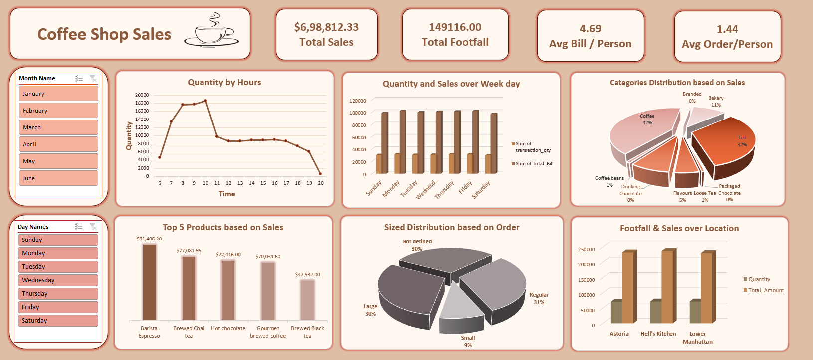

# ☕ Coffee Shop Sales Dashboard

An interactive sales analytics dashboard built to track revenue, footfall, and product performance across a coffee shop chain with 3 locations. The dashboard combines KPI cards, trend charts, and category breakdowns to give a complete picture of business performance.

## 📌 Overview

This project analyzes transactional sales data from a coffee shop business to uncover patterns in customer behavior, peak sales hours, top-performing products, and location-wise performance. The dashboard is fully interactive, with slicers for **Month** and **Day of Week**, allowing users to drill into specific time periods.

## 🎯 Key Metrics (KPIs)

| Metric | Value |
|---|---|
| Total Sales | $6,98,812.33 |
| Total Footfall | 1,49,116 customers |
| Avg. Bill / Person | $4.69 |
| Avg. Order / Person | 1.44 |

## 📊 Dashboard Components

- **Quantity by Hours** — Line chart showing order volume across the day; identifies peak and slow hours.
- **Quantity and Sales over Week Day** — Compares transaction quantity and total bill by day of the week.
- **Categories Distribution based on Sales** — 3D pie chart breaking down sales share by product category.
- **Top 5 Products based on Sales** — Bar chart ranking the best-selling products by revenue.
- **Sized Distribution based on Order** — Pie chart of order volume by size (Small / Regular / Large / Not Defined).
- **Footfall & Sales over Location** — Compares quantity sold and revenue across the 3 store locations.
- **Slicers** — Month Name and Day Names filters for dynamic, on-demand analysis.

## 🔍 Key Insights

### Sales by Time of Day
- **Best time:** 8 AM – 10 AM, the busiest period with quantity peaking above 18,000 units.
- **Worst time:** After 6 PM, when sales drop sharply.
- Staffing and stock should be prioritized for the morning rush; evenings are consistently slow.

### Sales by Day of Week
- **Monday and Friday** post the highest sales.
- **Saturday and Sunday** see the lowest sales.
- This points to a weekday-driven business, with customers buying coffee around work hours.

### Monthly Revenue Trend
| Month | Revenue |
|---|---|
| January | $81,677 |
| February | $76,145 (only month with a drop) |
| March | $98,834 |
| April | $1,18,941 |
| May | $1,56,727 |
| June | $1,66,485 |

Revenue more than **doubled from January to June**, with consistent month-over-month growth from March onward.

### Location Performance
| Location | Units Sold | Revenue |
|---|---|---|
| Hell's Kitchen | 71,737 | $2,36,511 |
| Lower Manhattan | 71,742 | $2,30,057 |
| Astoria | 70,991 | $2,32,243 |

All three locations perform at a similar level (within $6,454 of each other). Notably, **Lower Manhattan sells the most units but earns the least revenue**, suggesting customers there favor lower-priced items — an opportunity for upselling.

### Top 5 Products by Revenue
1. Barista Espresso — $91,406
2. Brewed Chai Tea — $77,081
3. Hot Chocolate — $72,416
4. Gourmet Brewed Coffee — $70,034
5. Brewed Black Tea — $47,932

**Barista Espresso** is the top product by a clear margin.

### Sales by Category
- Coffee — 42% (largest category)
- Tea — 32%
- Bakery — 11%
- Drinking Chocolate — 8%
- Flavours — 5%
- Other (Branded, Packaged, Loose Tea, Coffee Beans) — 2%

### Order Size Distribution
- Regular — 31%
- Large — 30%
- Not Defined — 30% (no size recorded)
- Small — 9%

## 🛠️ Tools Used

- **Excel** (Pivot Tables, Pivot Charts, Slicers) for data modeling and visualization
- **Data Analytics** techniques for trend, category, and location-level analysis

## 📷 Preview

